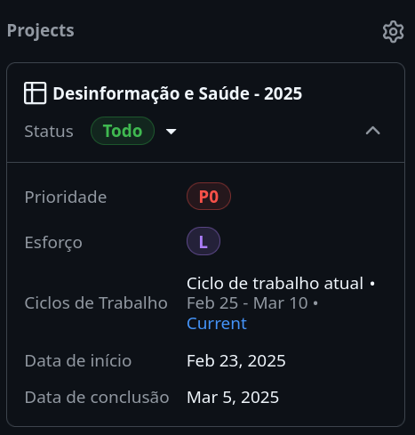

# 🐞 **Relatório de Erro**

## **Descreva o Bug**

- **O que aconteceu:** Descreva de forma clara e objetiva o problema encontrado.  
- **Onde ocorreu:** Mencione o repositório, arquivo ou função específica (se aplicável).  
- **Impacto:** Qual o impacto desse bug para o andamento do projeto?  

---

## **Reproduzir o Erro**

Descreva as etapas para reproduzir o comportamento:

1. Vá para '...'
2. Clique em '...'
3. Role até '...'
4. Veja o erro

---

## **Comportamento Esperado**

Descreva de forma clara o que você esperava que acontecesse.

---

## **Screenshots**

Se aplicável, adicione capturas de tela para ajudar a explicar seu problema.

---

## **Desktop (por favor, preencha as seguintes informações):**

- **SO:** [por exemplo, Windows, macOS, Linux]  
- **Versão do Python:** [por exemplo, 3.10]  
- **Terminal ou terminal virtual:** [por exemplo, Terminal, PowerShell] e sua versão  
- **Navegador:** [por exemplo, Chrome, Firefox] (se aplicável)  

---

## **Contexto Adicional**

Adicione qualquer outro contexto relevante sobre o problema, logs de erro ou soluções que tentou.

---

## **Inclua as informações adicionais na aba lateral direita da issue:**

- **Labels:** marque como `bug` e outras labels adequadas.  
- **Type:** defina o tipo da issue como `bug`.  
- **Assignees:** atribua responsáveis pela tarefa.  
- **Milestone:** vincule a um marco do projeto.  

---

## **Após a criação da issue**

Marque os seguintes dados relativos ao projeto na **aba lateral direita** conforme a imagem:

### **Status**

- TODO  
- Em Progresso  
- Concluído  
- Arquivada  

---

### **Prioridade**

- P0 (Crítica)  
- P1 (Alta)  
- P2 (Média)  
- P3 (Baixa)  

---

### **Esforço Estimado**

- XS (Extra Pequeno)  
- S (Pequeno)  
- M (Médio)  
- L (Grande)  
- XL (Extra Grande)  

---

### **Ciclo de Trabalho**

Os ciclos de trabalho estão organizados em duas semanas. Marque a issue no ciclo de trabalho correspondente.

- Ciclo de Trabalho Atual  
- Ciclo de Trabalho 2  
- Ciclo de Trabalho 3  

---

### **📅 Datas**

- **Data de Início:** _(DD/MM/AAAA)_  
- **Data de Término:** _(DD/MM/AAAA)_  

---

**🔄 Lembre-se:** As informações acima devem ser preenchidas para garantir o rastreamento adequado das tarefas no projeto **Desinformação e Saúde - 2025**.  

Se tiver dúvidas, consulte a equipe de suporte [@suporte-github] ou abra uma discussão.

Para saber mais sobre markdown, veja os links disponíveis na [issue #1](https://github.com/LABHDUFBA/ds25-organizacao/issues/1).

**As listas e informações padrões desse template devem ser apagadas após o preenchimento da issue.**
