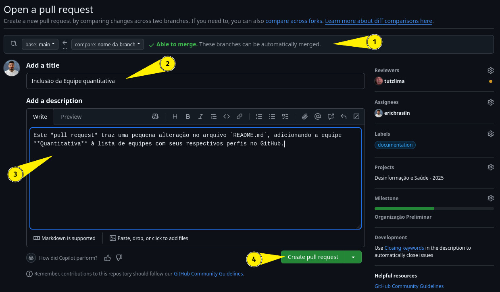

# Fluxo de Trabalho no GitHub (Versão Web)

## Acesse o repositório correto

- [Organização](https://github.com/LABHDUFBA/ds25-organizacao)
- [Análise Qualitativa](https://github.com/LABHDUFBA/ds25-analise-quali)
- [Análise Quantitativa](https://github.com/LABHDUFBA/ds25-analise-quanti)
- [ELT](https://github.com/LABHDUFBA/ds25-elt)

---

## Crie uma nova `branch`

1. Clique no botão `main`, é nele onde se seleciona a `branch` que está trabalhando;
2. Clique em `View all branches`;

1. Clique em `New branch`, no canto superior direito;
2. Escreva o nome da _branch_, de preferência seu nome ou usuário, como: `eric`, `eric-brasil` ou `ericbrasiln` (sem letras maiúsculas, símbolos ou espaços)
3. Mantenha `Source` como `main`
4. Clique em `Create branch`

- Retorne à página inicial do repositório clicando em `Code`.

---

## Acesse sua branch

1. Verifique o repositório clicando no botão `main`;
2. Selecione `nome-da-branch`.

Para ter certeza que trocou, verifique o nome da branch no canto superior esquerdo.

---

## Commits 

Você pode criar ou modificar arquivos. Caso queira criá-los:

- Certifique-se que está em `nome-da-branch `;
1. Clique em `Add file`;
- Escolha dentre as opções 1 (`Create new file`) ou 2 (`Upload files`):

### *Create new file*

1. Nomeie seu arquivo (`Name your file...`) com a **extensão do arquivo**: `exemplo.md`, `index.html`, `ata_reuniao_19_04_1503.txt`, etc...;
2. Adicione o conteúdo;
3. Clique em `Commit changes`, botão verde no canto superior direito;

Na caixa aberta, atente-se às duas descrições:

1. `Commit message` é o **título** do seu commit, logo, deve ser sucinto (não ultrapassar 50 caracteres). Por exemplo: 

>`Update arquivo.md`
>
>`Create arquivo.md`
>
>`Delete arquivo.md`

2. `Extended description` é a **descrição** do seu commit, onde detalhará quais alterações foram feitas [^1]. Por exemplo:

[^1]: No `commit`, pode escrever um pequeno texto corrido ou tópicos (bem melhor, visualmente). No `pull request`, escreva suas descrições em **markdown**!

>Atualizei o arquivo da seguinte forma:
>
>- Revisei a descrição das variáveis coletadas
>
>- Atualizei os dados no documento

3. Mantenha a opção `Commit directly to the **nome-da-branch** branch`

4.  Clique em `Commit changes`

- Retorne ao repositório

- **Verifique, novamente, se está em `nome-da-branch`**

### *Upload files*

- Arraste ou copie e cole [^2] o arquivo na região `Drag files here to add them to your repository`, ou escolha-os diretamente de um diretório local ( `choose your files`)

[^2]: Copiar e colar: selecione o arquivo que deseja copiar e pressione `Ctrl` + `c`; retorne ao github e cole o arquivo pressionando `Crtl` + `v`

- Em `Commit changes`, temos a mesma ideia anterior: um título e uma descrição

- Mantenha a opção `Commit directly to the **nome-da-branch** branch`

-  Clique em `Commit changes`

### *Modificar arquivos existentes*

- Certifique-se que está em `nome-da-branch `
- Clique no arquivo que deseja modificar
- Clique no ícone de edição no canto superior direito do arquivo (`edit this file`, um lápis)
- Realize as alterações desejadas
- Clique em `Commit changes`, botão verde no canto superior direito
- Na caixa aberta, atente-se às duas descrições (`Commit message` e `Extended description`)
- Mantenha a opção `Commit directly to the **nome-da-branch** branch`
- Clique em `Commit changes`
- Retorne ao repositório

Depois disso, garanta que alterou tudo que desejava da forma adequada antes de seguir para o próximo passo.

---

## Criar Pull Request (PR)

- **Verifique, novamente, se está na sua `branch`**

- No painel superior, acesse a aba `Pull requests` do repositório

- Clique em `Compare & pull request`

1. Verifique se o PR está na configuração padrão:

>`base: main ← compare: **nome-da-branch** ✔️ Able to merge. These branches can be automatically merged.`

Isso quer dizer que você vai solicitar a integração dos commits da `nome-da-branch` com a `main`.

O final da mensagem, `✔️ Able to merge [...]`, é sinal que o Github **não encontrou conflitos** dos arquivos de `nome-da-branch` com a `main`!

2. Em `Add a title`, adicione um título para seu PR
3. Em `Add a description`, descreva as mudanças que deseja integrar à `main` [^1]
4. Clique em `Create pull request`

---

## Solicitar Revisão e mais informações

Dentro do Pull Request, na coluna à direita existem algumas opções que devem ser preenchidas:

1. Reviewers: adicione um ou mais revisores para analisar as alterações, de preferência **@ericbrasiln** ou **@leofn**
2. Assignees: adicione um ou mais responsáveis pelo PR, de preferência você mesmo;
3. Labels: adicione as labels que melhor descrevem o PR, como `documentation`, `treinament`, `bug`, etc...
4. Projects: adicione o projeto ao qual o PR está relacionado: *Desinformação e Saúde - 2025*
5. Milestone: adicione o marco ao qual o PR está relacionado

Após a vinculação do PR com o projeto, novas opções aparecerão e devem ser corretamente preenchidas:

1. Status: adicione o status do PR como `TODO`, `Em Progresso`, `Consluído`, etc...
2. Prioridade: adicione a prioridade do PR como P0, P1, P2, etc...
3. Esforço: adicione o esforço do PR como `XS`, `S`, `M`, `L`, `XL`
4. Ciclo de trabalho: adicione o ciclo de trabalho como `Ciclo de trabalho atual`, `Ciclo de Trabalho 2` ou `Ciclo de Trabalho 3`
5. Data de início: adicione a data de início do PR
6. Data de término: adicione a data de término do PR

Aguarde o feedback e, caso tudo esteja ok, seus commits serão aceitos!

---

## Merge

Após a revisão e aprovação do PR, você pode fazer o `merge` dos commits na `main`.

- Clique em `Merge pull request`

- Confirme clicando em `Confirm merge`

- Caso tudo ocorra bem, verá a mensagem `Pull request successfully merged and closed`

- Não delete o branch, pois ele pode ser útil para futuras referências.

---
