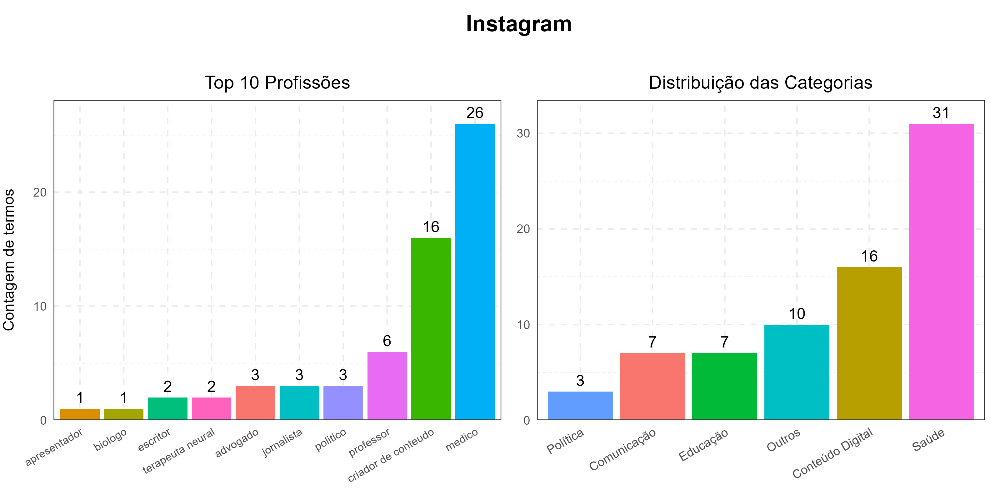
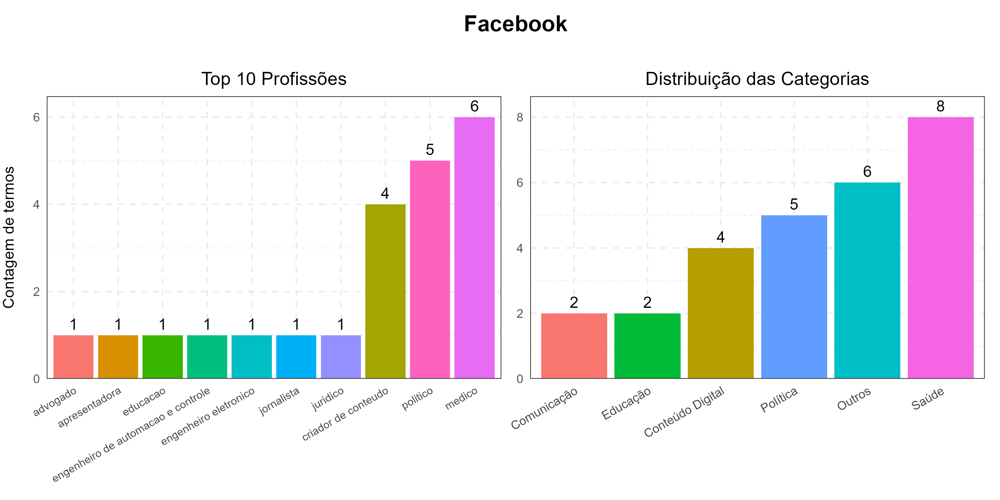

## Descrição da tarefa

O diretório comporta a listagem dos perfis antivax em cada uma das plataformas almejadas pela pesquisa: Facebook, Instagram, YouTube e TikTok.

## Variáveis

### Perfil

Nome de exibição do perfil coletado (corresponde a `Username`, de forma geral).

Tipo da variável: **texto**

### Link do perfil

Link do perfil coletado.

As variáveis ainda são passíveis de discussão e, para aprimorar os resultados da categorização e visualização, seria preciso revistar os links inseridos.

Tipo da variável: **texto**

### Link de post

Link do post coletado.

Tipo da variável: **texto**

### Conteúdo de post

Descrição do assunto tratado no post.

Tipo da variável: **texto**

### Antivax

Indicamos se o **perfil** e/ou **post** se apresentam como antivax.

Tipo da variável: **`TRUE` (1) OR `FALSE` (0)**

### Provax

Indicamos se o **perfil** e/ou **post** se apresentam como provax.

*(Precisa ser preenchida, pois foi inserida posteriormente)*

Tipo da variável: **`TRUE` (1) OR `FALSE` (0)**

### Conspiracionista

Indicamos se o **perfil** e/ou **post** apresentam discursos relacionados a chips de nanotecnologia, proteína spike, chip de hidrogel, agenda 2030, marca da besta, big pharma, bill gates, etc.

Tipo da variável: **`TRUE` (1) OR `FALSE` (0)**

### Negacionista

Indicamos se o **perfil** e/ou **post** apresentam discursos negacionistas / céticos, isto é, questionam a eficácia das vacinas, relatam reações adversas, divulgam procedimentos de desintoxicação vacinal ou métodos alternativos para problemas de saúde.

Essa variável, em especial, exige refinamento, pois todos os casos `antivax == TRUE` implicam `negacionista == TRUE`.

Tipo da variável: **`TRUE` (1) OR `FALSE` (0)**

### Profissão específica

O objetivo é ter uma noção dos profissionais que estão produzindo conteúdo de saúde nas plataformas.

Tipo da variável: **texto**

### Profissão reduzida

Para facilitar a visualização ao final do script, algumas profissões foram reduzidas.

Por exemplo:

|profissao_especifica|profissao_reduzida|
|:---:|:---:|
|medico otorrinolaringologista|medico|
|terapeuta|terapeuta|
|medico infectologista|medico|

Tipo da variável: **texto**

---

## Visualização básica

### Instagram

### Facebook

---

